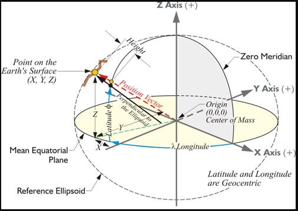

### A .NET class library for Converting WGS84/UTM coordinates to Latitude and Longitude using CoordinateSharp NuGet library This library contains utility methods that can be called from Microsoft SQL Server as SQL functions within transact sql code (t-sql)
---
 


Example T-SQL Command 
---
```
SELECT FACILITYID, dbo.UTM2LATITUDE(shape.STX, shape.STY, 'S', 17) AS Latitude,
dbo.UTM2LONGITUDE(shape.STX, shape.STY, 'S', 17) AS Longitude
FROM dbo.MyFeatureSet
```

UTM Grid Zones Reference: http://www.dmap.co.uk/utmworld.htm

After you have compiled the solution in Visual Studio or SharpDev, place the built dll into a directory your SQL instance can access. Then you can wrap it into a t-sql CLR stored procdure. 

```
USE [INSERT_DB_NAME_HERE]
GO

ALTER DATABASE [INSERT_DB_NAME_HERE] SET trustworthy ON
GO

CREATE ASSEMBLY CoordinateSharp from '[INSERT_ASSEMBLY_PATH_HERE]\CoordinateSharp.dll' WITH PERMISSION_SET = UNSAFE
GO


CREATE ASSEMBLY UTM2LATSqlServerLibrary from '[INSERT_ASSEMBLY_PATH_HERE]\UTM2LATSqlServerLibrary.dll' WITH PERMISSION_SET = UNSAFE
GO

CREATE FUNCTION UTM2LATITUDE(@XUTM float, @YUTM float, @HEMISPHERE nvarchar(1), @ZONE int)
RETURNS [float] WITH EXECUTE AS CALLER
AS
EXTERNAL NAME [UTM2LATSqlServerLibrary].[UTM2LATSqlServerLibrary.UTM2LATSqlServerLibrary].[UTM2LATITUDE]
GO

CREATE FUNCTION UTM2LONGITUDE(@XUTM float, @YUTM float, @HEMISPHERE nvarchar(1), @ZONE int)
RETURNS [float] WITH EXECUTE AS CALLER
AS
EXTERNAL NAME [UTM2LATSqlServerLibrary].[UTM2LATSqlServerLibrary.UTM2LATSqlServerLibrary].[UTM2LONGITUDE]
GO

CREATE FUNCTION UTM2LAT(@XUTM float, @YUTM float)
RETURNS [float] WITH EXECUTE AS CALLER
AS
EXTERNAL NAME [UTM2LATSqlServerLibrary].[UTM2LATSqlServerLibrary.UTM2LATSqlServerLibrary].[UTM2LAT]
GO

CREATE FUNCTION UTM2LONG(@XUTM float, @YUTM float)
RETURNS [float] WITH EXECUTE AS CALLER
AS
EXTERNAL NAME [UTM2LATSqlServerLibrary].[UTM2LATSqlServerLibrary.UTM2LATSqlServerLibrary].[UTM2LONG]
GO

sp_configure 'clr enabled', 1
GO

RECONFIGURE
GO
```
